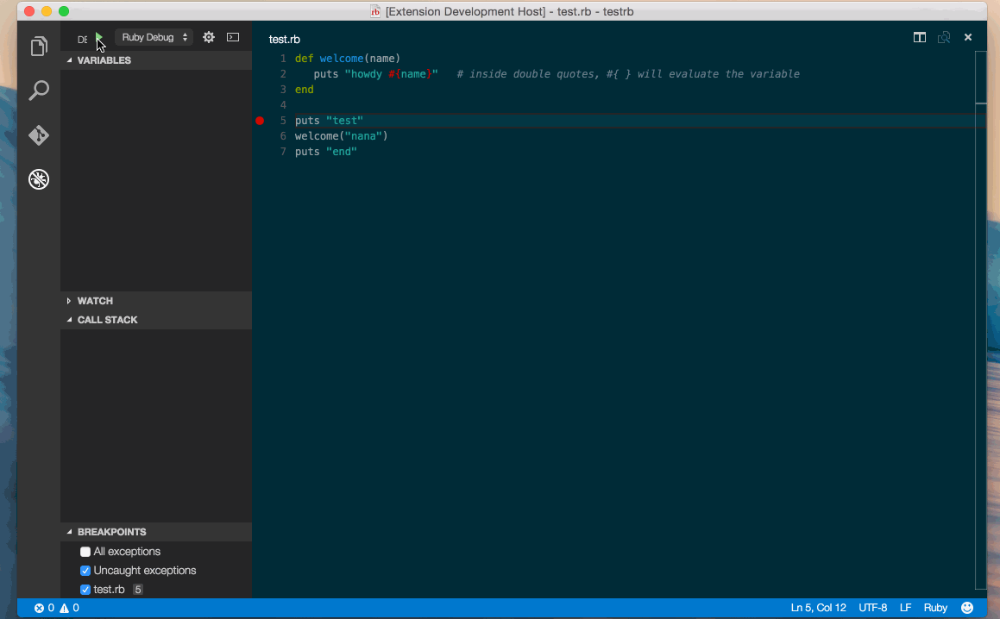

# Ruby Language and Debugging Support for Visual Studio Code

This extension provides rich Ruby language and debugging support for Visual Studio Code.
It's still in progress ( hosted in [GitHub](https://github.com/rebornix/vscode-ruby.git) ) and not useful yet, please expect frequent updates with breaking changes before 1.0.



## Install
### Install Extension
Press `F1`, type `ext install ruby`.

### Install Ruby Dependencies
In this extension, we implement [ruby debug ide protocol](http://debug-commons.rubyforge.org/protocol-spec.html) to allow VS Code to communicate with ruby debug. This is also how RubyMine does in default.

- `gem install ruby-debug-ide`
- `gem install ruby-debug-base19x`

### Add VS Code config to your project
- create `.vscode` folder under the root directory of your project
- create `launch.json` in `.vscode/` like below
```
{
	"version": "0.2.0",
	"configurations": [
		{
			"name": "Ruby Debug",
			"type": "Ruby",
			"request": "launch",
			"program": "${workspaceRoot}/test.rb",
			"stopOnEntry": false
		}
	]
}
```

## Features

- Local script debugging (currently it only supports single file)

## TODO
- Full support for Continue/StepIn/StepOut/Next
- Variables Inspect and Stack Frame support
- Multithread
- Rails support
- IntelliSense
- Linting

## License

This extension is [licensed under the MIT License](LICENSE.txt).
